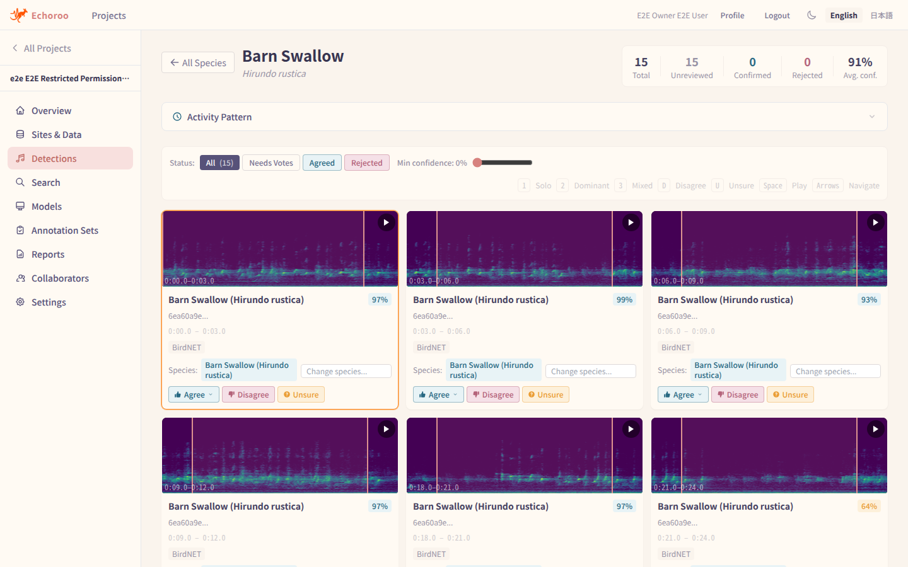
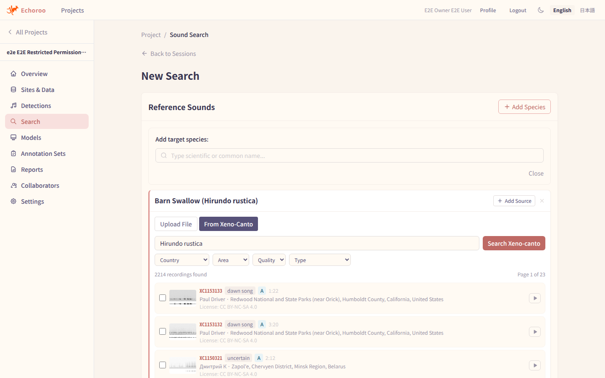
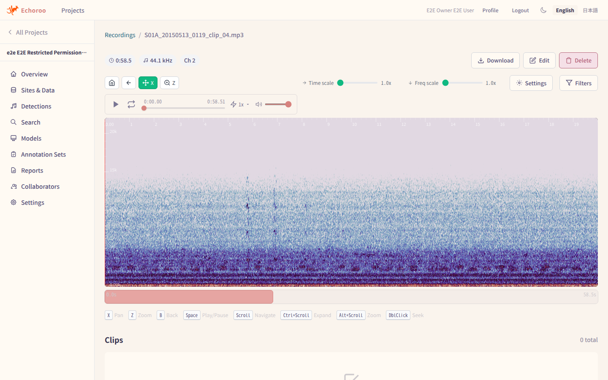
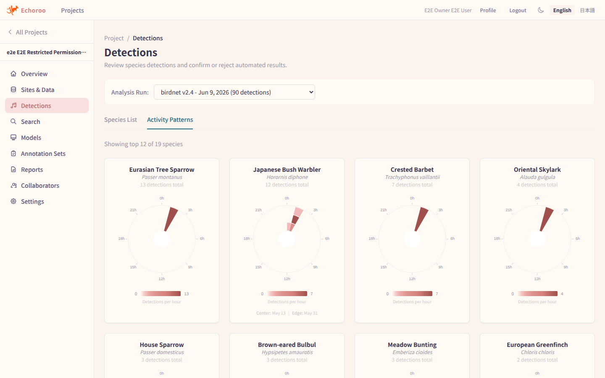

# Echoroo

Echoroo is an open-source, web-based ecoacoustic platform. Integrated with state-of-the-art AI, Echoroo enables fast and efficient analysis, search, and development of new models for acoustic data.

Echoroo is built for wildlife surveyors — NPOs, local governments, and researchers — who collect field recordings with autonomous recorders (e.g. AudioMoth) and want to know *which species were present, where, and when*, without being experts in bioacoustics or machine learning. See [VISION.md](VISION.md) for the full product vision.

## Features

- **ML-first workflow** — recordings are automatically analyzed on import (BirdNET species detection + Perch acoustic embeddings); users review ML results instead of annotating from scratch.
- **Detection review** — species-list and card-based review UIs with spectrograms; confirm, reject, or re-label detections with precise time ranges.
- **Similarity search** — find species not covered by BirdNET (mammals, amphibians, insects, rare species) by searching the whole dataset with Perch embeddings and pgvector.
- **Sampling review** — review random time segments to build negative data and quality-check ML results; "nothing found" is recorded distinctly from "not yet reviewed".
- **Traceability** — every detection carries its origin: model name, version, confidence, and human verification status.
- **Exports** — detection CSVs for survey reports, and ML-ready training datasets (positive + negative clips with metadata).
- **Data management** — projects, sites (H3 map cells), datasets, and recordings, with roles, permissions, and cross-project sharing of verified detections.

## Screenshots



*Detection review — verify BirdNET detections at a glance from a spectrogram grid, voting Agree/Disagree on each clip.*



*Sound search — build a similarity search from reference sounds fetched directly from Xeno-canto, with recordist attribution and CC licenses shown in-app.*



*Recording viewer — explore a full recording with an interactive spectrogram, audio playback, and zoom/pan controls.*



*Activity patterns — per-species diel (24-hour) activity charts summarizing when each species was detected across a BirdNET run.*

## Quick Start

`./echoroo.sh` is **the supported install and management path** for Echoroo. It runs the full stack (PostgreSQL + pgvector, Redis, LocalStack, backend, frontend, Celery ML workers) with Docker.

**Prerequisites:** [Docker](https://docs.docker.com/get-docker/) 24.0+ with [Docker Compose](https://docs.docker.com/compose/install/) 2.0+.

```bash
# Clone the repository
git clone https://github.com/0kam/echoroo.git
cd echoroo

# Configure settings
cp .env.example .env
# Edit .env to set:
#   - POSTGRES_PASSWORD (required)
#   - INVITATION_TOKEN_HMAC_KEY (required)
#   - ECHOROO_AUDIO_DIR (required - path to your audio files)
# Generate a value for INVITATION_TOKEN_HMAC_KEY with:
openssl rand -hex 32

# Prepare local dev prerequisites and validate configuration
./echoroo.sh install
./echoroo.sh checkenv

# Start Echoroo (development mode)
./echoroo.sh start
```

Then open http://localhost:5173 in your browser.

If `.env` is missing, `install` creates it from `.env.example` and exits
non-zero so you can edit the required values before starting.

### Everyday commands

```bash
./echoroo.sh start          # Start
./echoroo.sh status         # Show containers and health
./echoroo.sh logs           # View logs
./echoroo.sh stop           # Stop containers, keep data
./echoroo.sh migrate        # Run Alembic migrations
./echoroo.sh update --ref main   # Update to latest main and rebuild
./echoroo.sh help           # Full command reference
```

See the [Docker Guide](DOCKER.md) for the full `./echoroo.sh` command table, service topology, GPU setup, and container troubleshooting.

### Running without Docker

Local (non-Docker) development requires Python 3.11+, [uv](https://docs.astral.sh/uv/), Node.js 20+, and PostgreSQL (or SQLite). See [CONTRIBUTING.md](CONTRIBUTING.md#running-without-docker) for the commands and the [Configuration Guide](CONFIGURATION.md#2-local-development-without-docker) for database setup.

## ML Configuration

Echoroo uses GPU-accelerated machine learning models (BirdNET, Perch — both on TensorFlow) for species detection. The defaults preserve GPU behaviour, so a host with a working NVIDIA GPU needs no extra settings.

- Full ML environment-variable reference and performance tuning (batch size, feeders, CPU mode, memory limits): [Configuration Guide](CONFIGURATION.md#machine-learning-settings)
- Running without an NVIDIA GPU, or with a GPU TensorFlow cannot use (e.g. Blackwell / RTX 50-series), and `CUDA_ERROR_OUT_OF_MEMORY` troubleshooting: [Docker Guide — GPU Support](DOCKER.md#gpu-support)

## Documentation

- [Docker Guide](DOCKER.md) — services, volumes, GPU support, container troubleshooting, production deployment notes
- [Configuration Guide](CONFIGURATION.md) — environment variable reference and deployment scenarios
- [Contributing Guide](CONTRIBUTING.md) — development setup, quality gates, PR conventions
- [Architecture](ARCHITECTURE.md) — technical specification
- [Product Vision](VISION.md) — mission, target users, and roadmap
- [Model Licenses](MODEL_LICENSES.md) — licenses for ML model weights (BirdNET, Perch)
- [Operational Runbooks](docs/runbook/) — backups, key rotation, release readiness

## Licensing

Echoroo's source code is licensed under the **GNU General Public License v3**
(see [LICENSE](LICENSE)).

Machine-learning **model weights are licensed separately** and are not covered
by Echoroo's code license — see [MODEL_LICENSES.md](MODEL_LICENSES.md) for
details. In particular, the **BirdNET** model weights are distributed under
**CC BY-NC-SA 4.0 (non-commercial)**, so deployments that use them are subject
to those non-commercial terms. Third-party software dependencies retain their
own licenses ([THIRD_PARTY_LICENSES.md](THIRD_PARTY_LICENSES.md)).

## Acknowledgements

This project is built upon the [Whombat](https://github.com/mbsantiago/whombat) project, originally developed with the generous support of the Mexican Council of the Humanities, Science and Technology (**CONAHCyT**; Award Number 2020-000017-02EXTF-00334) and University College London (**UCL**).
